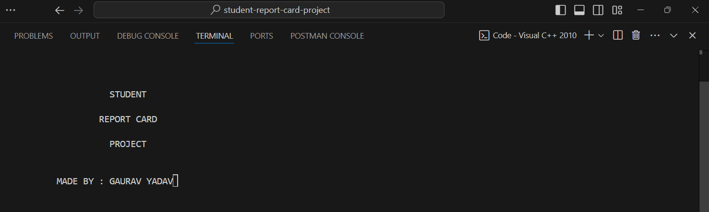
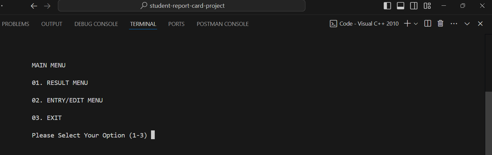
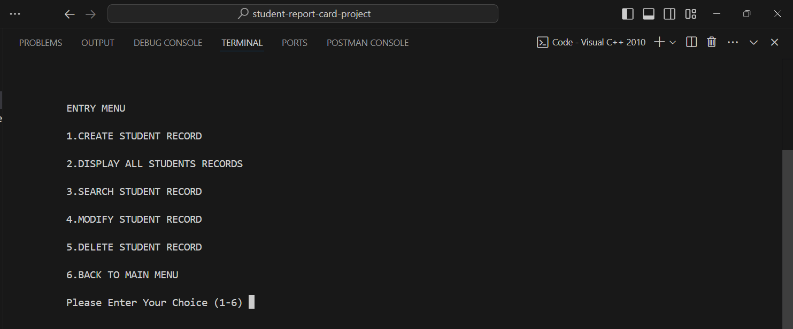

# Student Report Card Management System

This project is a console-based application written in **C++** for managing student report cards. It allows the user to create, display, search, modify, and delete student records.

## Features

- **Create Student Record**: Enter student details like roll number, name, and marks for five subjects, then save the data in a file.
- **Display All Records**: Shows all stored records of students with detailed information.
- **Search by Roll Number**: Allows searching for a student’s report card by their roll number.
- **Modify Student Record**: Update details of a student by providing their roll number.
- **Delete Student Record**: Remove a student’s record by roll number.
- **Display Class Results**: Show all students' report cards in a tabular format, including marks, percentage, and grade.

## Grading System

- **A**: 60% and above
- **B**: 50% to 59%
- **C**: 33% to 49%
- **F**: Below 33%

## File Details

- **student.dat**: The binary file where student records are saved.

## How to Run the Program

1. Clone the repository or download the project files.
2. Compile the C++ code using a compiler (e.g., g++ or Visual Studio).
3. Run the program in your terminal or IDE.
4. Use the menu options to navigate through the functionalities.

## Menu Options

- **1. Create Student Record**
- **2. Display All Students' Records**
- **3. Search Student Record**
- **4. Modify Student Record**
- **5. Delete Student Record**
- **6. Back to Main Menu**

---

Made by: **Gaurav Yadav**
